# Workflow — de l'inscription à la première transaction

Ce document trace, étape par étape, le tout premier parcours d'un nouvel
utilisateur : inscription → création de son premier compte → saisie de sa
première transaction → visualisation dans le dashboard. Chaque étape montre
la requête exacte, la réponse, et **quelle valeur de la réponse réutiliser à
l'étape suivante**.

Pour la référence complète de chaque endpoint (tous les champs optionnels,
tous les codes d'erreur), voir [GUIDE-API-FRONTEND.md](./GUIDE-API-FRONTEND.md).
Ce fichier-ci ne couvre que le chemin nominal (happy path) du tout premier
onboarding.

## Vue d'ensemble

```mermaid
sequenceDiagram
    actor U as Utilisateur
    participant F as Front
    participant A as API

    U->>F: Remplit le formulaire d'inscription
    F->>A: POST /auth/register
    A-->>F: 201 { utilisateur, accessToken, refreshToken } + cookies

    Note over F,A: Le front sait maintenant que l'utilisateur est connecté.

    F->>A: GET /comptes
    A-->>F: 200 { comptes: [] }

    Note over F: Liste vide → afficher l'écran<br/>"Crée ton premier compte"

    U->>F: Remplit le formulaire de compte
    F->>A: POST /comptes
    A-->>F: 201 { compte: { id, solde, ... } }

    Note over F: On a maintenant un compteId à utiliser

    F->>A: GET /categories (optionnel, pour peupler un <select>)
    A-->>F: 200 { categories: [...] }

    U->>F: Saisit sa première dépense/revenu
    F->>A: POST /transactions (categorieId omis)
    A-->>F: 201 { transaction: { categorieId auto-assigné, ... } }

    F->>A: GET /dashboard/soldes
    F->>A: GET /dashboard/depenses-par-categorie
    A-->>F: 200 (soldes et répartition à jour)

    Note over F: Écran d'accueil affiché avec les vraies données
```



## Étape 1 — Inscription

```http
POST /api/v1/auth/register
Content-Type: application/json

{
  "email": "aissatou@example.com",
  "motDePasse": "MonMotDePasse123",
  "nom": "Diop",
  "prenom": "Aissatou"
}
```

Réponse `201` :

```json
{
  "utilisateur": {
    "id": "9f2b...-uuid",
    "email": "aissatou@example.com",
    "nom": "Diop",
    "prenom": "Aissatou",
    "emailVerifie": false
  },
  "accessToken": "eyJhbGciOi...",
  "refreshToken": "6f1a2c..."
}
```

**À conserver côté front** : rien à faire manuellement si tu appelles l'API
avec `credentials: "include"` — le serveur pose déjà les cookies httpOnly
`accessToken`/`refreshToken`. Si tu es en mode "token géré par le front"
(mobile, ou store côté web), garde `accessToken` pour l'en-tête
`Authorization: Bearer ...` des appels suivants.

> `emailVerifie: false` est normal — la vérification d'email n'est pas
> bloquante pour utiliser le reste de l'API dans cette version. Un email de
> vérification est envoyé en parallèle, mais rien n'empêche de continuer
> l'onboarding immédiatement.

## Étape 2 — Vérifier qu'il n'y a pas encore de compte financier

```http
GET /api/v1/comptes
Authorization: Bearer eyJhbGciOi...
```

Réponse `200` :

```json
{ "comptes": [] }
```

**Décision UX** : `comptes` est vide → c'est la toute première connexion,
affiche l'écran "Crée ton premier compte" avant de proposer quoi que ce soit
d'autre (impossible de saisir une transaction sans compte).

## Étape 3 — Créer le premier compte financier

```http
POST /api/v1/comptes
Authorization: Bearer eyJhbGciOi...
Content-Type: application/json

{
  "nom": "Compte courant",
  "type": "COURANT",
  "soldeInitial": 50000,
  "devise": "XOF"
}
```

Réponse `201` :

```json
{
  "compte": {
    "id": "3c7e...-uuid",
    "nom": "Compte courant",
    "type": "COURANT",
    "soldeInitial": 50000,
    "solde": 50000,
    "devise": "XOF",
    "institution": null,
    "couleur": null
  }
}
```

**À conserver côté front** : `compte.id` → c'est le `compteId` qu'il faudra
fournir à chaque création de transaction (étape 5).

## Étape 4 — (Optionnel) Charger les catégories pour le formulaire

Si le formulaire de saisie propose un sélecteur de catégorie (au lieu de
compter uniquement sur l'auto-catégorisation) :

```http
GET /api/v1/categories
Authorization: Bearer eyJhbGciOi...
```

Réponse `200` :

```json
{
  "categories": [
    {
      "id": "cat-1-uuid",
      "nom": "Alimentation",
      "type": "DEPENSE",
      "icone": "🛒",
      "couleur": null,
      "parentId": null
    },
    {
      "id": "cat-2-uuid",
      "nom": "Transport",
      "type": "DEPENSE",
      "icone": "🚗",
      "couleur": null,
      "parentId": null
    },
    {
      "id": "cat-3-uuid",
      "nom": "Salaire",
      "type": "REVENU",
      "icone": "💼",
      "couleur": null,
      "parentId": null
    }
    /* ... 17 catégories système au total */
  ]
}
```

**Recommandation** : ne rends pas ce sélecteur obligatoire dans le formulaire
de première saisie. Laisser le champ vide déclenche l'auto-catégorisation
côté serveur (étape 5) — meilleure expérience pour un premier essai rapide.

## Étape 5 — Saisir la première transaction

```http
POST /api/v1/transactions
Authorization: Bearer eyJhbGciOi...
Content-Type: application/json

{
  "compteId": "3c7e...-uuid",
  "montant": 2500,
  "type": "DEPENSE",
  "libelle": "Yango vers le bureau",
  "dateOperation": "2026-07-21"
}
```

Notez : **pas de `categorieId`** dans cette requête — c'est volontaire.

Réponse `201` :

```json
{
  "transaction": {
    "id": "8a1f...-uuid",
    "compteId": "3c7e...-uuid",
    "categorieId": "cat-2-uuid",
    "montant": 2500,
    "type": "DEPENSE",
    "libelle": "Yango vers le bureau",
    "note": null,
    "dateOperation": "2026-07-21",
    "pointee": false
  }
}
```

Le serveur a reconnu le mot-clé "Yango" dans le libellé et a automatiquement
assigné la catégorie "Transport" (`cat-2-uuid`). **Affiche cette catégorie
devinée dans l'UI** (ex. un badge "Catégorie suggérée : Transport,
modifier ?") plutôt que de la cacher — c'est la valeur ajoutée de
l'auto-catégorisation (US3).

Si l'utilisateur veut corriger la catégorie après coup :

```http
PATCH /api/v1/transactions/8a1f...-uuid
Content-Type: application/json

{ "categorieId": "cat-1-uuid" }
```

## Étape 6 — Afficher le tableau de bord à jour

Les deux appels peuvent partir en parallèle juste après l'étape 5 (ou au
chargement de l'écran d'accueil) :

```http
GET /api/v1/dashboard/soldes
Authorization: Bearer eyJhbGciOi...
```

```json
{
  "soldes": {
    "comptes": [
      { "compteId": "3c7e...-uuid", "nom": "Compte courant", "solde": 47500, "devise": "XOF" }
    ],
    "totalGlobal": 47500
  }
}
```

```http
GET /api/v1/dashboard/depenses-par-categorie
Authorization: Bearer eyJhbGciOi...
```

```json
{ "depenses": [{ "categorieId": "cat-2-uuid", "nomCategorie": "Transport", "montantTotal": 2500 }] }
```

Le solde (`50000 - 2500 = 47500`) et la répartition par catégorie reflètent
immédiatement la transaction saisie à l'étape 5 — aucun rechargement ni
recalcul manuel n'est nécessaire côté front, tout est recalculé à la volée
par le serveur à chaque appel.

## Récapitulatif des valeurs à faire circuler entre les étapes

| Valeur produite à l'étape    | Réutilisée à l'étape  | Sous quel nom                                                                               |
| ---------------------------- | --------------------- | ------------------------------------------------------------------------------------------- |
| `accessToken` (1)            | 2, 3, 4, 5, 6         | en-tête `Authorization` (ou cookie automatique)                                             |
| `compte.id` (3)              | 5                     | `compteId` dans le corps de `POST /transactions`                                            |
| `categorieId` (4, optionnel) | 5                     | `categorieId` dans le corps de `POST /transactions` (sinon omis pour l'auto-catégorisation) |
| `transaction.id` (5)         | correction éventuelle | `:id` dans `PATCH /transactions/:id`                                                        |

## Erreurs à gérer explicitement dans ce parcours

- **Étape 5 sans compte créé** : si le front tente `POST /transactions` avec
  un `compteId` invalide/inexistant → `404`. Ne devrait pas arriver si
  l'étape 2/3 est respectée, mais à gérer en garde-fou (redirection vers la
  création de compte).
- **Token expiré en cours de parcours** (après 15 min d'inactivité) : `401`
  sur n'importe quel appel → appeler `POST /auth/refresh` puis rejouer la
  requête. Voir [GUIDE-API-FRONTEND.md, section 2](./GUIDE-API-FRONTEND.md#2-authentification).
- **Validation de formulaire** (`422`) à l'étape 3 ou 5 : afficher
  `erreurs[].message` par champ (voir format dans le guide principal).
